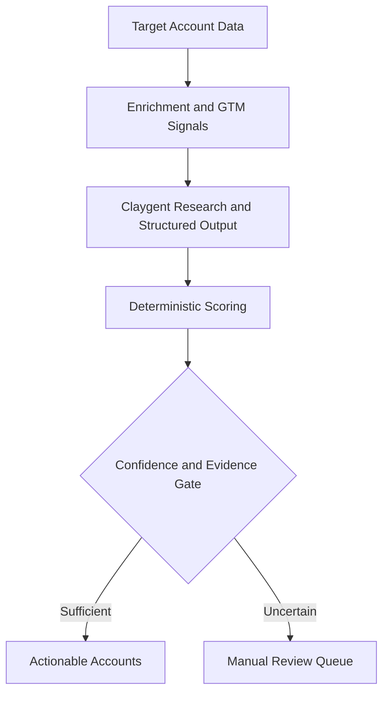
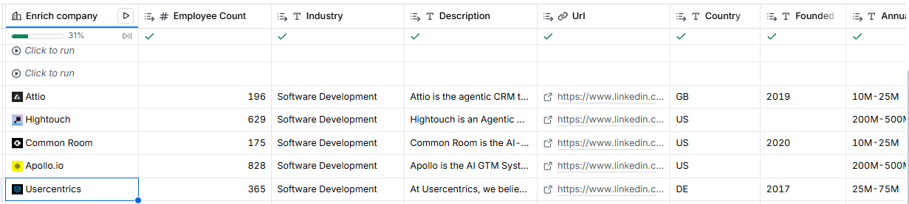
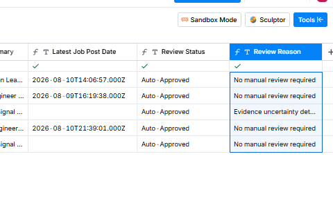
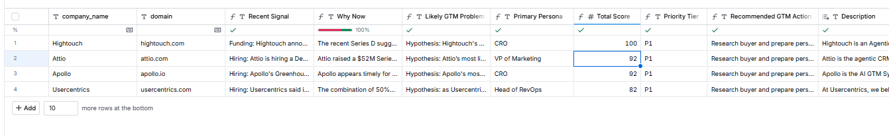

# P3 — AI-Assisted GTM Intelligence & Account Prioritization System

An evidence-aware GTM intelligence implementation that transforms raw B2B account data into enriched, explainable, prioritized, and operationally actionable account decisions.

[](LICENSE)
[](https://github.com/mahdi-eqbal/p3-ai-gtm-intelligence-system/actions/workflows/repository-quality.yml)


> This is an independently designed and implemented professional case study. It does not represent a client deployment, employer implementation, paid engagement, production revenue result, or claimed commercial outcome.

## Quick Review

- [Implementation summary](docs/implementation-summary.md)
- [ICP definition](docs/icp-definition.md)
- [Prioritization model](docs/prioritization-model.md)
- [AI guardrails and evidence policy](docs/evidence-ai-guardrails.md)
- [Project brief](docs/project-brief.md)
- [Structured output schemas](schemas/)
- [Sample data](sample-data/)
- [Formal test matrix](TEST-MATRIX.md)
- [Evidence manifest](evidence/EVIDENCE-MANIFEST.md)
- [Implementation evidence](evidence/)

## Business Problem

A target-account list does not tell a revenue team:

- which accounts actually fit the ICP;
- which accounts show meaningful and recent GTM activity;
- why an account may be relevant now;
- what revenue or GTM problem may exist;
- which buyer persona is most relevant;
- which accounts should be prioritized;
- when AI-generated research is too uncertain for automated action.

This system turns those questions into a repeatable intelligence and prioritization workflow while keeping final operational decisions deterministic and reviewable.

## System Architecture



### End-to-End Processing Flow

```text
Raw Account List
    ↓
Real / Synthetic Record Separation
    ↓
Company Enrichment
    ↓
GTM Job-Signal Monitoring
    ↓
Signal-to-Account Resolution
    ↓
Signal Context Generation
    ↓
Claygent Web Research + Structured Intelligence
    ↓
Deterministic Fit, Signal, Confidence, and Timing Scores
    ↓
Priority Tier + Human Review Gate
    ↓
Actionable Accounts or Manual Review Queue
    ↓
CSV Delivery Export
```

## System Responsibilities

| Layer | Responsibility |
|---|---|
| Account dataset | Maintains target companies and stable account identity |
| Clay enrichment | Adds firmographic and company-context data |
| Clay Signals | Detects GTM hiring activity and related timing signals |
| Signal resolution | Links zero, one, or multiple signal records to the correct account |
| Claygent | Produces structured, evidence-aware research and hypotheses |
| Deterministic scoring | Converts structured inputs into explainable component scores and priority tiers |
| Human review gate | Prevents uncertain research from entering the actionable queue automatically |
| Delivery layer | Produces actionable-account and manual-review outputs for downstream use |

## Core Capabilities

### Account Enrichment

Real company domains are enriched with firmographic and contextual data. Synthetic `.example` records remain available for logic testing but are excluded from paid enrichment and production-like signal monitoring.



### GTM Signal Monitoring

Clay Job Posting Signals identify relevant GTM hiring activity across target accounts. A multi-row lookup links signal records back to the target account using company domain, supporting zero, one, or multiple signals per account.

### Evidence-Aware AI Research

The Claygent research layer produces structured fields for:

- ICP fit and reasoning;
- recent GTM signal;
- signal evidence;
- why-now analysis;
- likely GTM problem;
- primary buyer persona;
- confidence level;
- uncertainty notes.

The agent is instructed to distinguish facts from inference, avoid inventing company facts or buying intent, frame GTM problems as hypotheses, and expose uncertainty.

### Structured Output Preservation

The original structured response is preserved while individual fields are extracted into operational columns. This supports traceability between source research, interpreted fields, downstream scoring, and the final action state.

### Deterministic Prioritization

AI does not directly assign the final operational priority. Structured outputs are converted into separate components:

- ICP Fit Score;
- Signal Score;
- Confidence Score;
- Timing Score;
- Total Priority Score;
- Priority Tier.

The scoring logic and decision boundaries are documented in the [prioritization model](docs/prioritization-model.md).

### Signal Timing

The latest matched signal date is converted into an explicit recency component:

| Signal age | Timing score |
|---|---:|
| Within 30 days | 10 |
| 31–90 days | 7 |
| 91–180 days | 3 |
| Older or unavailable | 0 |

### Human-in-the-Loop Governance

Confidence, evidence quality, uncertainty, and priority state are evaluated separately from the numeric score. Accounts with material uncertainty are routed to Manual Review even when the score might otherwise qualify them for action.



### Delivery Layer

The system produces two operational outputs:

- **Actionable Accounts** — sufficiently supported accounts ready for downstream GTM use;
- **Manual Review Queue** — accounts requiring human judgment before action.



The actionable dataset was also validated through a downstream CSV export.

## Validated Behaviors

| Area | Validated behavior |
|---|---|
| Data control | Real-company enrichment and synthetic-record isolation |
| Signal monitoring | GTM job-signal detection and multi-record support |
| Identity | Signal-to-account resolution using company domain |
| Context | Signal context passed into the AI research layer |
| Research | Web research fallback and evidence/inference separation |
| Structured AI | Raw output preservation and field-level extraction |
| Scoring | Deterministic fit, signal, confidence, and timing components |
| Prioritization | Explainable priority-tier assignment |
| Governance | Uncertainty-based manual-review routing |
| Delivery | Actionable-account view, review queue, and CSV export |

See the [formal test matrix](TEST-MATRIX.md) for the complete validation scope.

## Evidence

Evidence is organized to show the implemented system progressively:

- initial target-account inputs;
- company enrichment results;
- job-signal detection;
- signal-to-account lookup;
- signal schema and context integration;
- signal-date extraction;
- human-review routing;
- actionable and manual-review outputs;
- downstream exports.

The complete index is available in the [Evidence Manifest](evidence/EVIDENCE-MANIFEST.md).

## Repository Structure

```text
p3-ai-gtm-intelligence-system/
├── docs/         # Project brief, ICP, scoring, implementation, and AI governance documentation
├── evidence/     # Clay workflow evidence and delivery exports
├── sample-data/  # Public-safe account data for inspection and testing
├── schemas/      # Structured AI output contracts
├── .gitignore
├── README.md
└── TEST-MATRIX.md
```

## How to Review the Implementation

1. Read the [implementation summary](docs/implementation-summary.md).
2. Review the [ICP definition](docs/icp-definition.md) and [prioritization model](docs/prioritization-model.md).
3. Inspect the [AI guardrails and evidence policy](docs/evidence-ai-guardrails.md).
4. Review the structured contracts under [`schemas/`](schemas/).
5. Compare expected behavior with [`TEST-MATRIX.md`](TEST-MATRIX.md).
6. Follow the executed system sequence through the [Evidence Manifest](evidence/EVIDENCE-MANIFEST.md).

## Governance and Public-Safety Controls

- facts and inferences are explicitly separated;
- AI-generated problems are treated as hypotheses;
- uncertainty and confidence are exposed;
- deterministic rules control final scoring and priority;
- uncertain accounts require human review;
- synthetic records are isolated from paid enrichment;
- credentials, private API keys, and sensitive contact data are excluded from public assets.

## What This Project Demonstrates

- GTM Engineering and account-intelligence workflow design;
- Clay enrichment and multi-table signal resolution;
- Claygent research with structured output contracts;
- evidence-aware AI guardrails;
- explainable, deterministic post-AI scoring;
- signal recency and why-now logic;
- confidence and uncertainty handling;
- human-in-the-loop governance;
- operational delivery views and downstream exports;
- evidence-based implementation validation.

---

Built by [Mahdi Eqbal](https://github.com/mahdi-eqbal) as an independent Revenue Systems / GTM Engineering implementation case study.


